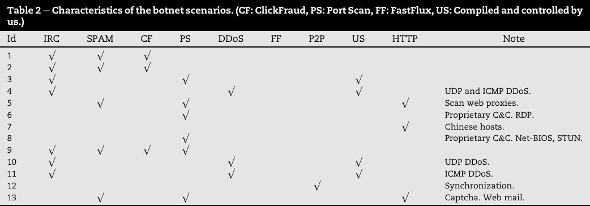

# Botnet Detection using Hortonworks Cybersecurity Platform (HCP)

Detection of Botnet traffic using various malware across different protocols and performing various actions.

### [Dataset](https://www.stratosphereips.org/datasets-ctu13/) Used

### Cluster Setup [Instructions](cloudbreak/Cluster-Setup.md)

