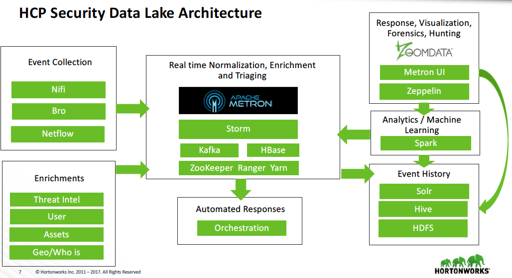
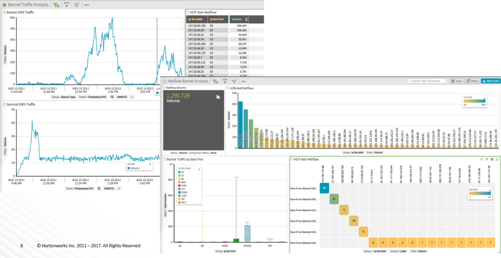

# Botnet Detection using Hortonworks Cybersecurity Platform (HCP)

Detection of Botnet traffic comprising of various malware across different protocols and performing various actions using [HCP](https://hortonworks.com/products/data-platforms/cybersecurity/) powered by [Apache Metron](http://metron.apache.org/)


### [Dataset](https://www.stratosphereips.org/datasets-ctu13/) Used

The CTU-13 is a dataset of botnet traffic that was captured in the CTU University, Czech Republic, in 2011. The goal of the dataset was to have a large capture of real botnet traffic mixed with normal traffic and background traffic. The CTU-13 dataset consists in thirteen captures (called scenarios) of different botnet samples. On each scenario we executed a specific malware, which used several protocols and performed different actions.


### Cluster Setup [Instructions](cloudbreak/Cluster-Setup.md)


Provision HCP 1.6 cluster (HDP 2.6.5, HDF 3.1.2, HDP Search 3.0.0) using Cloudbreak 2.7


##### Prerequisites

 * Access to [Hortonworks Cloudbreak 2.7](https://docs.hortonworks.com/HDPDocuments/Cloudbreak/Cloudbreak-2.7.1/content/index.html) instance setup with credentials for respective cloud providers
 * [Cloudbreak CLI](https://docs.hortonworks.com/HDPDocuments/Cloudbreak/Cloudbreak-2.7.1/content/cli-install/index.html) installed, in path and configured to point to the Cloudbreak instance

 You can also use [this tool](https://github.com/amolthacker/hwx-local-cloudbreak) to setup a local instance of Cloudbreak with a configured CLI

##### Steps

 1. Clone the repo
 
 2. Update cloud configurations
    - under `cloudbreak/clusters/field/hwx-hcp.json` for OpenStack Field Cloud
    - under `cloudbreak/clusters/aws/hwx-hcp.json` for AWS
    
   especially:
   ```
    general.credentialName                  // credential to use as configured in Cloudbreak
    tags                                    // tags for billing, ops and audit
    placement                               // region and availability zone
    network                                 // configured virtual private network
    instanceGroups.template.instanceType    // instance types
    instanceGroups.template.securityGroup   // configured network security group associated with the network
    stackAuthentication                     // configured SSH key details
   ```

3. Setup Cloudbreak and Create Cluster
   
   If running for the first time, run
   ```
   $  ./scripts/import-artifacts-n-create-cluster.sh <CLOUD> [where CLOUD => 'field' or 'aws']
   ```
   This will first import:
   - mpacks (specified in `cloudbreak/scripts/import-mpacks.sh`)
   - recipes (under `cloudbreak/recipes`) 
   - blueprint (under `cloudbreak/blueprints`)
   into Cloudbreak and then create the cluster

   If the mpacks, recipes and blueprints have already been imported, run
   ```
   $  ./scripts/create-cluster.sh <CLOUD>
   ```


### Architecture




### Simulation


